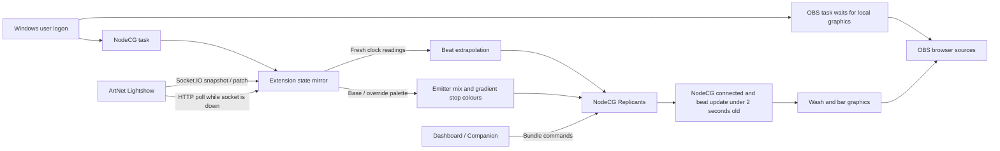

# party-visuals

Party graphics for OBS that keep time with the lightshow
([artnet-lightshow](https://github.com/tyclab/artnet-lightshow)). A
[NodeCG](https://www.nodecg.dev) 2 bundle that runs in the same NodeCG as
[EclipseGraphics](https://github.com/LightD31/EclipseGraphics): EclipseGraphics draws the
cards, lower thirds and tickers, this bundle draws what moves with the music behind and
around them.

- **Colour wash** (`graphics/wash.html`): the whole frame in the lightshow's palette, to
  sit under EclipseGraphics' cards. The colours turn and flow with the beat; each beat
  lifts the wash a little and swells a glow in the middle.
- **Beat bar** (`graphics/bar.html`): a band of the palette's colours across the bottom of
  the frame (`?position=top` for the top), scrolling half a block a beat and swelling on
  each beat.

Both are 1920 × 1080 with a transparent background, take the lightshow's palette (its
palette override when it has one, else the look's colours), and:

- **never pulse faster than 5 Hz**, the photosensitivity limit the lightshow holds its own
  strobe to: up to 300 bpm a pulse a beat,
  above that every second or fourth beat, and at
  least 200 ms between two pulses whatever the beat position does;
- **draw at most `graphics.maxFps` frames a second** (30 by default);
- **go calm when the lightshow or NodeCG link is gone**: no new pulse, the glow fades
  within a second, the motion stops where it was and the last colours stay. Graphics
  require a connected NodeCG socket, a connected lightshow and a beat update less than
  two seconds old. A lost NodeCG socket stops new pulses immediately; missing beat
  updates stop them after two seconds. Reconnecting waits for a fresh beat update and
  eases the beat back in.

The beat comes from the lightshow, not from a tap here. Between the lightshow's readings
the extension and every graphic extrapolate the beat at the last tempo, so the pictures
move smoothly at the graphics' own frame rate.

## Install beside EclipseGraphics

NodeCG 2 (tested with 2.8.0) and Node 22 or later, as for EclipseGraphics. The bundle
has one dependency of its own, `socket.io-client`.

**With EclipseGraphics' own `npm start`** (NodeCG installed as EclipseGraphics'
dependency, which loads the bundles in its `bundles/` folder too):

```
cd EclipseGraphics
git clone https://github.com/tyclab/party-visuals bundles/party-visuals
cd bundles/party-visuals && npm install --omit=dev && cd ../..
echo bundles/ >> .git/info/exclude
```

Then write the configuration below into EclipseGraphics' `cfg/` folder and `npm start` as
before.

**In a NodeCG installation with a `bundles/` folder**: clone into
`bundles/party-visuals`, run `npm install --omit=dev` there, and put the configuration
in that installation's `cfg/` folder.

The dashboard (<http://127.0.0.1:9090/>) gets a **Party visuals** panel next to
EclipseGraphics' panels.

## Install on the show PC

[`install/`](install) has what a Windows PC that runs OBS and Companion for the show
needs:

| File | |
|---|---|
| [`Install-PartyVisuals.ps1`](install/Install-PartyVisuals.ps1) | Installs EclipseGraphics and this bundle at pinned commits, keeps NodeCG to this machine, stores the lightshow token and, with `-Autostart`, starts NodeCG at logon. Windows PowerShell 5.1 or PowerShell 7. |
| [`Start-PartyVisualsOBS.ps1`](install/Start-PartyVisualsOBS.ps1) | Optional OBS task action: waits for both local graphics, opens the selected collection/profile in the desktop, and avoids a second OBS process. |
| [`obs-scene-collection.json`](install/obs-scene-collection.json) | The OBS scene collection **Party Visuals**: the wash and the bar as 1920 × 1080 browser sources. |
| [`companion-page.md`](install/companion-page.md) | A Companion page with the lightshow's buttons and the visuals' side by side. |

From a normal (not elevated) PowerShell window, as the Windows user who runs the show:

```
git clone https://github.com/tyclab/party-visuals
cd party-visuals\install
powershell -ExecutionPolicy Bypass -File .\Install-PartyVisuals.ps1 -LightshowUrl http://<lightshow host>:3000 -Autostart -WhatIf
powershell -ExecutionPolicy Bypass -File .\Install-PartyVisuals.ps1 -LightshowUrl http://<lightshow host>:3000 -Autostart
Start-ScheduledTask -TaskName 'PartyVisuals NodeCG'
```

The run with `-WhatIf` lists what would change and changes nothing. The run without it
asks for the lightshow's token (its **Settings → Server & access**; the input is
hidden). Then the dashboard, <http://127.0.0.1:9090/>, shows the **Party visuals**
panel and its link to the lightshow.

What the script does:

1. Checks for Node.js 22 or later and git. Without them it prints the command that
   installs them (`winget install --id OpenJS.NodeJS.LTS --exact`,
   `winget install --id Git.Git --exact`) and stops.
2. Clones EclipseGraphics into `%LOCALAPPDATA%\PartyVisuals\EclipseGraphics` (`-Root`
   for another folder) and runs `npm ci` with install scripts off. Only better-sqlite3,
   NodeCG's database driver, then runs its own: it fetches or builds the native module
   NodeCG cannot start without. With npm 11.16 or later that one allowance is a line in
   the checkout's `.npmrc`.
3. Clones this bundle into its `bundles\party-visuals` and runs `npm ci --omit=dev`.
4. Writes `cfg\nodecg.json` (NodeCG on 127.0.0.1:9090) and `cfg\party-visuals.json`
   (the lightshow's address and the token file; a new one also gets `graphics.offsetMs`
   at 0 for the beamer), keeping any other setting already in them, a tuned `offsetMs`
   included.
5. Writes the token to `cfg\party-visuals.token`, readable by this Windows user only
   (inheritance off, one rule). It is not shown, logged or put on a command line.
6. With `-Autostart`, registers the scheduled task **PartyVisuals NodeCG**, which runs
   EclipseGraphics' `start.js` at this user's logon in a console window; closing the
   window stops its current process. The task ignores duplicate starts, has no time
   limit, starts when a missed trigger becomes available, and retries a failed process
   every minute up to 999 times. Use `Stop-ScheduledTask` for an intentional stop.

It can be run again: what is in place is kept, and the packages are installed again
only when a lockfile or the Node.js major version changed. `-NewToken` asks for the token again,
`-LightshowUrl` changes the address, `-EclipseGraphicsCommit` and `-BundleRef` (a commit,
or a `vX.Y.Z` tag) move the pins, and `-Uninstall` removes the task and the folder, only
a folder the script set up (its marker file in it) and not one reached through a link.
NodeCG reads its configuration and the token when it starts, so restart it after a
change. The rest is in the script's help, read with the execution policy bypassed as
for the run (a plain `Get-Help` finds nothing while the policy blocks scripts):

```
powershell -ExecutionPolicy Bypass -Command "Get-Help .\Install-PartyVisuals.ps1 -Detailed"
```

By hand on the show PC:

- **OBS:** Scene Collection → Import → `install\obs-scene-collection.json`, then pick
  the **Party Visuals** collection from the Scene Collection menu. The sources are
  1920 × 1080 at the top left; on another base canvas (Settings → Video) fit each one to
  the screen (Ctrl+F). EclipseGraphics' overlay, when it is used, goes between the wash
  and the bar. Put the scene on the beamer the way the show does it, e.g. a fullscreen
  projector on the beamer's display.
- **Companion:** build the page from [`companion-page.md`](install/companion-page.md);
  Companion's page export has no stable format to import.
- **The beamer:** judged on the real screen: `graphics.offsetMs` in
  `cfg\party-visuals.json` (restart NodeCG after a change), the intensities (wash 50 and
  bar 80 by default, from the panel or Companion), and a look at the wash's pulse for
  photosensitivity.

For OBS login startup, copy `Start-PartyVisualsOBS.ps1` to a stable local folder and
create one Task Scheduler task for the show user's logon, **Run only when user is
logged on**, with a 30-second delay. Run Windows PowerShell with arguments
`-NoProfile -ExecutionPolicy Bypass -WindowStyle Hidden -File "<launcher path>" -Profile "<existing profile name>"`.
The default collection and scene are **Party Visuals**. Set **Start in** to the
launcher's folder, ignore new instances, remove the execution time limit, and enable
restart on failure every minute. Check for an existing OBS Startup shortcut or task
before adding one.

The helper waits up to five minutes for both graphics to answer locally; a timeout
fails the task so its retry can handle a slow NodeCG startup. OBS starts minimized
with its executable folder as its working directory, without output-start flags.
The helper keeps running until OBS exits and passes its exit code to Task Scheduler.
It preserves saved projectors. OBS stores their display numbers, so verify the target
with the intended display enabled before saving a fullscreen projector; a missing
display must not be replaced with another monitor. OBS 32 can prompt after an unclean
shutdown, which still needs a desktop response before a normal launch continues.

NodeCG listens on 127.0.0.1 only, so OBS and Companion run on the show PC too. The show
PC reaches the lightshow at its port 3000, which the lightshow's host has to admit from
the show PC's address; that is set up on the lightshow's host, not by this script. The
address's host name has to be one the lightshow answers to (its machine name, an IP
address, or its **Public URL**), or the lightshow answers 403 and the panel says so
([The network](#the-network)).

## Configuration

`cfg/party-visuals.json` (all optional; [`configschema.json`](configschema.json)
describes it):

```json
{
  "lightshow": {
    "url": "http://tychome:3000",
    "tokenFile": "cfg/party-visuals.token"
  }
}
```

and `cfg/party-visuals.token` holding the lightshow's access token (its
**Settings → Server & access**) and nothing else.

**The token goes in a file, never in `cfg/party-visuals.json`**: NodeCG hands the bundle's
configuration to every page of the bundle, the OBS sources included, so anything in it can
be read by whatever can open a graphic. Only the extension reads the token file. A
`token` key in the configuration stops NodeCG at startup with a schema error; an address
with a token or a password in it is refused too (the connection shows the error and
nothing is sent).

| Option | |
|---|---|
| `lightshow.url` | The lightshow server, `http(s)://host:port` (default `http://127.0.0.1:3000`). |
| `lightshow.tokenFile` | The token file; a relative path starts at the folder NodeCG runs from. Empty: a lightshow with no token (bound to loopback). |
| `lightshow.pollMs` | How often `GET /api/state` is polled while the socket is down (default 1000). |
| `lightshow.reconnect.minMs` · `maxMs` | The wait before reconnecting: doubling from 500 ms up to 15 s, a little shorter at random. |
| `graphics.maxFps` | The most frames a second a graphic draws (default 30). |
| `graphics.offsetMs` | Shift the graphics' beat, −1000 to 1000 ms: positive draws it earlier, to make up for a projector's or OBS's delay. Judge it on the real screen. |
| `allowHosts` | Host names the `api/` addresses answer to besides IP addresses, `localhost` and `*.local` (Companion calling this machine by name). |

### The network

On the show PC, NodeCG reaches the lightshow over the network (`tychome:3000` in the
example above). The lightshow host keeps port 3000 to loopback and its single-sign-on
front door, so this connection needs a route: either the port opened to the show PC's
address, or a path through the front door that accepts the lightshow token on its own
(an extension cannot answer a browser login). Which one is a deployment decision, made and
recorded with the deployment, not in this repository. The lightshow also refuses host
names it does not know: reaching it by a name other than its machine name needs that name
as its **Public URL** (Settings → Server & access).

## OBS

One browser source per graphic, 1920 × 1080:

| Source | URL |
|---|---|
| Colour wash, under EclipseGraphics' overlay | `http://127.0.0.1:9090/bundles/party-visuals/graphics/wash.html` |
| Beat bar, over it | `http://127.0.0.1:9090/bundles/party-visuals/graphics/bar.html` (`?position=top` for the top) |

The state lives in the extension, so a source refreshed or opened mid-show comes back as
it was. With NodeCG's login on, add the user's `?key=…` (NodeCG's Graphics tab gives the
address with it).

## Companion

Bitfocus Companion's **Generic HTTP** module, a GET request, as for EclipseGraphics:
`http://127.0.0.1:9090/bundles/party-visuals/api/cmd/<target>/<command>`.

| Target | Command | |
|---|---|---|
| `wash` · `bar` · `all` | `air.on` · `air.off` · `air.toggle` | On, off (both fade over 0.4 s). `all/air.off` takes both off. |
| | `intensity.<0-100>` · `intensity.+<n>` · `intensity.-<n>` | Brightness in percent, or a nudge. |

For example `…/api/cmd/wash/air.toggle`, `…/api/cmd/bar/intensity.60`,
`…/api/cmd/all/air.off`. A command answers `{"ok": true, "controls": …}`, or HTTP 400 with
`{"ok": false, "error": …}`. Also:

- `POST …/api/cmd` with `{"target": "…", "cmd": "…"}`;
- `GET …/api/state`: the switches, the connection, the tempo and the palette;
- from another bundle: `nodecg.sendMessageToBundle('cmd', 'party-visuals', {target, cmd})`,
  or from an extension `nodecg.extensions['party-visuals'].command(target, cmd)`.

Commands are refused (HTTP 403) when a browser says they come from another site, and
`api/` answers only to IP addresses, `localhost`, `*.local` and the `allowHosts` names.
With NodeCG's login on, add the user's `?key=…`.

## Replicants

Written by the extension; graphics and panels read them.

| Replicant | |
|---|---|
| `bpm` | The lightshow's tempo (its clock's, else the typed one); null before it has sent one. |
| `beatPos` | `{beat, bpm, at, epoch, locked}`: the beat position at time `at` (ms since 1970), re-published twice a second while connected; graphics extrapolate from it. `locked` says whether the phase came from the lightshow or is the extension's own. |
| `clockSource` | What the lightshow's clock follows: `auto`, `cdj`, `track`, `live` or `tap`. |
| `palette` | The base look's screen colours as `#RRGGBB`, white, amber and UV mixed in as the lightshow's own swatches show them; selected gradients use the stop-colour approximation below. Kept across restarts. |
| `paletteOverride` | The lightshow's palette override as `#RRGGBB`, or null (also when the lightshow does not send one). |
| `connection` | `{status, via, since, lastUpdate, error, retryInMs, target}`; `status` is `connecting`, `connected`, `reconnecting`, `error` or `stopped` (NodeCG shutting down), `via` is `socket` or `http`. Never the token. |
| `controls` | `{wash: {on, intensity}, bar: {on, intensity}}`. Kept across restarts. |

Each has its JSON schema in `schemas/`.

## How it follows the lightshow



The extension is a read-only client of the lightshow server. It connects over Socket.IO
asking for protocol 2 (`auth: {token, protocol: 2}`), takes the snapshot, then applies
the patches, each domain's version in order; a missed patch makes it ask for the whole
state again (`sync`). It reads `bpm`, `clock` (`source`, `bpm`, and `beatPos` and `epoch`
when the lightshow sends them), `basePalette` and `overridePalette`. Older servers use
the four colour slots through the colour-preset catalogue and `paletteOverride`.
The three palette fields belong to the `look` domain; catalogue/library changes alone
do not refresh the beat. Palette-only and typed-bpm-only patches never reuse an old
`clock.beatPos` as a new clock reading. The extension sends nothing except `sync`.

Palette compatibility is checked against ArtNet Lightshow
[`2b539dc`](https://github.com/tyclab/artnet-lightshow/commit/2b539dc546757cb7f740817321eb7a56e0e88f44).
Hex colours accept `#RGB`, `#RRGGBB`, `#RRGGBBWW`, `#RRGGBBWWAA` and
`#RRGGBBWWAAUU`; the trailing bytes are emitters, never transparency. White adds to
all three screen channels, amber adds red and half as much green, and UV appears as
visible violet (20% red, 90% blue). Overflow is scaled proportionally, matching the
engine's swatches; a screen does not emit UV. New palette bodies take precedence;
clearing `overridePalette` restores the base colours. Stage random slots are resolved
by the engine before publication. An unresolved random marker uses its corresponding
legacy slot when available and is otherwise omitted; graphics never roll their own
random colours on refresh or reconnect.

**Gradient approximation:** the selected named gradient, or the selected gradient-set
role, supplies its stop colours in authored order (slot references and literal colours
both work). As in the engine, selection defaults to the first gradient. At most eight
distinct colours are retained in first-appearance order. The wash uses its existing
moving RGB blend and the bar uses its existing scrolling colour blocks. Stop positions,
RGB/OKLCH/step interpolation, wrap settings and repeated-stop spacing are not reproduced;
this follows the selected gradient's colours, not its authored spatial appearance.
Without a usable gradient, the palette's colours are used directly.

While the socket is down it polls `GET /api/state` (the token in the `X-Lightshow-Token`
header), so the tempo and colours get through a proxy that will not carry the socket.
Reconnecting is its own, with the backoff above, and goes on after a refused token, so a
token fixed on the lightshow's side is picked up without restarting NodeCG. A refused
poll (401: the token; 403: a host name the lightshow does not answer to) is not repeated
every second: the next socket attempt polls once more if it fails.

A lightshow that sends no beat position (the clock's `{source, bpm}` alone) still drives
the graphics at its tempo; the phase is then the extension's own, shared by every graphic.

## Development

Repository contribution rules and comment-limit approvals live in [AGENTS.md](AGENTS.md).

```
npm install
npm test
```

The tests run against a local mock of the lightshow's Socket.IO server; nothing leaves the
machine. `shared/` is loaded both by the extension and, as plain scripts, by the graphics.

On Windows, `powershell -NoProfile -ExecutionPolicy Bypass -File test\install.test.ps1`
checks the install script in a folder under `%TEMP%`: the token file, the configuration
merges and the install folder checks. It installs nothing and registers no task.
`test\obs-start.test.ps1` checks the OBS launcher with mocked HTTP and process calls.

## Licence

MIT, see [LICENSE](LICENSE). NodeCG and Socket.IO are MIT-licensed.
